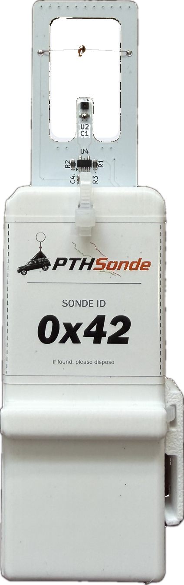
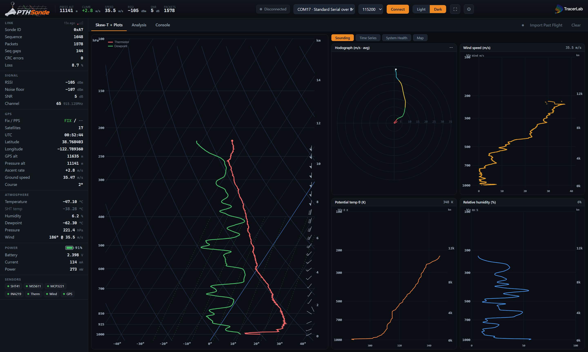
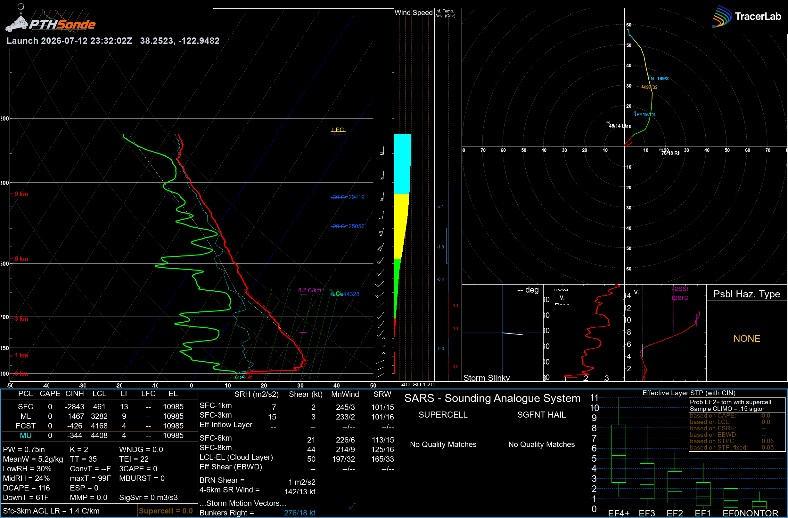
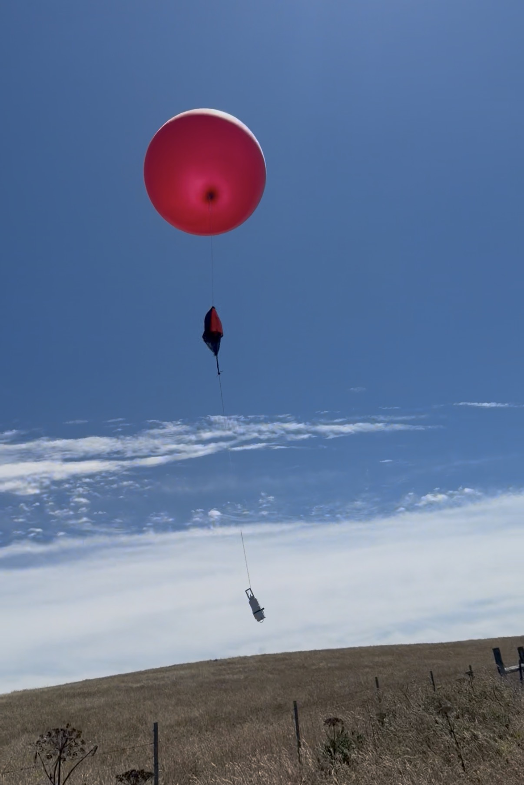

<p align="center">
  <picture>
    <source media="(prefers-color-scheme: dark)" srcset="latax/assets/logo_pthsonde_light.png">
    
  </picture>
</p>

<p align="center">
  <b>A complete, open radiosonde (weather-balloon) telemetry system</b><br>
  flight-hardware firmware · long-range LoRa ground link · packaged desktop ground station
</p>

---

<table>
<tr>
<td width="27%" align="center">
  
</td>
<td>
<p>PTHSonde flies a small ESP32-C3 payload that measures <b>P</b>ressure,
<b>T</b>emperature, and <b>H</b>umidity (plus wind, GPS, and battery), streams it over
915&nbsp;MHz LoRa to a ground receiver, and displays it in a one-click Windows app:
live Skew-T, hodograph, time-series, a GFS-fed landing-prediction map, and a full
SHARPpy SPC analysis panel.</p>
<p>Altitude, ascent rate, and the sounding are derived from the barometric pressure
sensor, so the profile keeps building past the GPS altitude ceiling — the flight
record is complete all the way to burst.</p>
</td>
</tr>
</table>

<p align="center">
  
  <br><sub><em>The desktop ground station — live Skew-T, hodograph, wind and thermodynamic profiles, and link health.</em></sub>
</p>

---

## System at a glance

```
   ┌──────────────────────── SONDE (in the air) ────────────────────────┐
   │  ESP32-C3-WROOM                                                     │
   │   • SHT41         temperature / relative humidity                   │
   │   • MS5611        barometric pressure  (drives altitude + ascent)   │
   │   • MCP3221 + NTC thermistor (primary air temperature)             │
   │   • INA219        battery voltage / current                         │
   │   • Quectel L86-M33 GPS   (Balloon mode — good to 80 km)            │
   │   • Ebyte E22-900T22S  LoRa @ 915 MHz, 22 dBm, 0.3 kbps (max range) │
   └───────────────────────────────┬────────────────────────────────────┘
                                    │  915 MHz LoRa
   ┌────────────────────────────────▼───────────────────────────────────┐
   │  GROUND RECEIVER — ESP32-C3 + E22, decodes packets, prints CSV      │
   └───────────────────────────────┬────────────────────────────────────┘
                                    │  USB serial
   ┌────────────────────────────────▼───────────────────────────────────┐
   │  PTHSonde DESKTOP APP  (Windows)                                    │
   │   • Python (Flask) owns the serial port + records the flight CSV    │
   │   • Native window (pywebview) renders the dashboard (single HTML)   │
   │   • SHARPpy renders the real SPC Skew-T/analysis panel on demand    │
   └────────────────────────────────────────────────────────────────────┘
```

## Repository layout

| Path | What it is |
|------|------------|
| [`SondeTransmitter/`](SondeTransmitter/) | **Flight firmware** (Arduino/ESP32-C3). Reads the sensors + GPS and transmits telemetry over LoRa. |
| [`GroundReceiver/`](GroundReceiver/) | **Ground-station firmware** (Arduino/ESP32-C3). Receives LoRa packets, prints them as CSV over USB. |
| [`Dashboard/`](Dashboard/) | The ground-station UI — a single self-contained `PTHSonde.html` (+ logo). |
| [`processor/`](processor/) | The Python app: `app.py` (pywebview launcher), `sonde_server.py` (Flask + serial + flight recording), `sharppy_render.py` (headless SHARPpy), and the PyInstaller spec. |
| [`docs/`](docs/) | Hardware map, firmware build/flash guide, and dashboard guide. |
| [`pins.txt`](pins.txt) | Verified ESP32-C3 pin map for the sonde board. |
| `Start PTHSonde.bat` | One-click launcher (runs the app from source). |

## Quick start

**Run the ground station (recommended):** download the prebuilt Windows app from
the [**Releases**](../../releases) page, unzip, and run `PTHSonde.exe`. Connect the
ground receiver over USB, select its COM port, and click **Connect**.

**Run from source** (needs Python 3.13):
```bash
pip install -r processor/requirements.txt      # flask, pyserial, pywebview, ...
# then, from the repo root:
Start PTHSonde.bat                              # or:  py -3.13 processor/app.py
```

**Build the firmware:** open `SondeTransmitter/SondeTransmitter.ino` and
`GroundReceiver/GroundReceiver.ino` in the Arduino IDE (ESP32-C3 board support,
`USB CDC On Boot: Enabled`) and flash each board. See
[`docs/firmware.md`](docs/firmware.md).

## Documentation

- [**docs/hardware.md**](docs/hardware.md) — boards, sensors, pin map, LoRa RF plan, GPS balloon mode.
- [**docs/firmware.md**](docs/firmware.md) — building & flashing both firmwares, the telemetry protocol, LED codes.
- [**docs/dashboard.md**](docs/dashboard.md) — using the app, recording a flight, the SHARPpy analysis, building the `.exe`.

## Key features

- **Complete soundings, every flight** — a full SHARPpy SPC Skew-T, hodograph, and
  severe-weather index panel, rendered from your balloon's own data.
- **Data all the way to burst** — altitude, ascent rate, and the profile come from the
  onboard pressure sensor, so the sounding never stops at the GPS ceiling.
- **Research-grade profiles** — automatic thermal-soak correction removes surface heat
  bias from the lowest levels, so lifted-parcel indices reflect the true atmosphere.
- **High-altitude tracking** — verified GPS balloon mode follows the flight to 80 km,
  well past the 12 km limit of standard receivers.
- **Long-range downlink** — a 22 dBm LoRa link engineered for maximum range and margin.
- **Reusable payload** — a rugged, recoverable sonde with a swappable battery and a
  unique per-unit ID.

<p align="center">
  
  <br><sub><em>A full SHARPpy SPC analysis panel rendered from a flight's own data.</em></sub>
</p>

<p align="center">
  
  <br><sub><em>A PTHSonde ascending under balloon and parachute shortly after launch.</em></sub>
</p>

---

*PTHSonde — Tracer Lab.*
